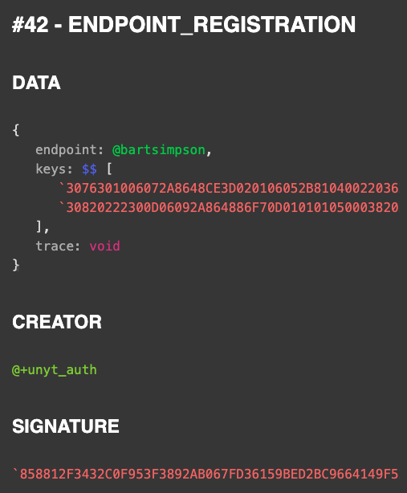
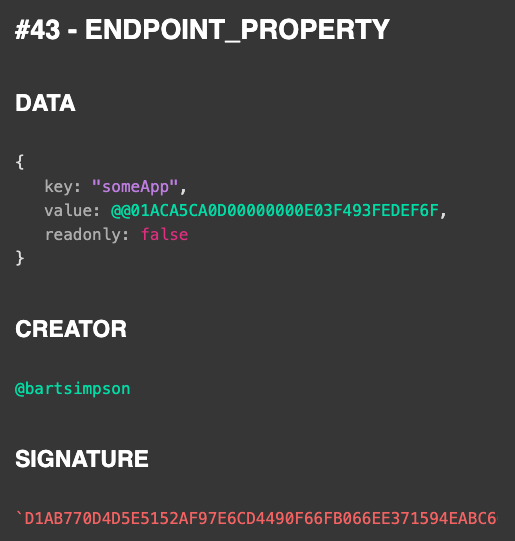
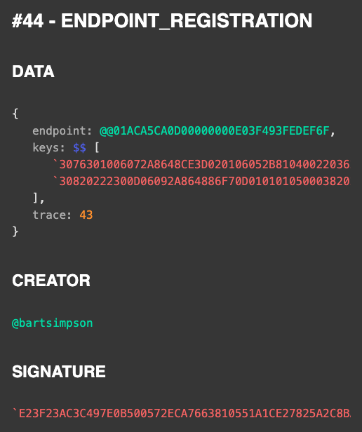
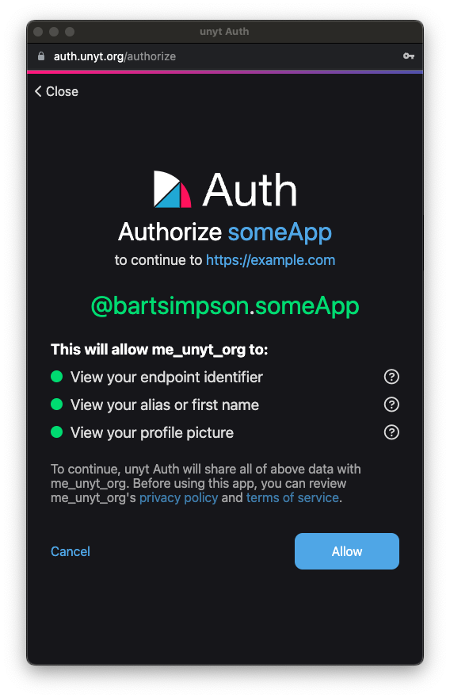

<!--
	{
		description: "We are introducing the unyt Auth service - your gateway to the Supranet.",
		preview: "res/unyt-auth.png",
		date: ~2023-12-10~,
		tag: "Community",
		author: "Jonas Strehle",
		authorRef: https://github.com/jonasstrehle
	};
-->


# Introducing: The unyt Auth service
We are shipping our brand new authentication service **"unyt Auth"** - a free of charge web-based authentication service that simplifies and enhances the process of endpoint authentication on the Supranet.

As of today - you can join the Supranet, our decentralized network, using your personal endpoint identifier and keys to connect to any of the available relays. Here unyt Auth serves as the new user-friendly web-based entry point to the network, ensuring a secure and reliable authentication flow for users.


> ## TL;DR 
> If you can't wait to register your personal endpoint with unyt Auth, go to [auth.unyt.org/redeem](https://auth.unyt.org/redeem) and redeem your token. You can then easily register with any app in the Supranet - how about [unyt Me](https://auth.unyt.org)?

## Endpoint Types
We distinguish between different endpoint types: **Personal endpoints** represent individuals such as people (`@elonmusk`). Entities such as organizations or companies are represented by **institutional endpoints** (`@+unyt`). **ID endpoints** are used for anonymous access on the Supranet (`@@1E4209D40D00000000A0B83C4BE18DF0`).

### Anonymous Endpoint
The Supranet allows the usage of anonymous unlinkable endpoint IDs, making it possible to join the network without leaving too many traces. Users can connect to the Supranet without revealing their real identities, thus ensuring their online privacy. To create anonymous endpoints for accessing the Supranet the unyt Auth service is not required (more information can be found in the [DATEX manual](https://docs.unyt.org/manual/datex/endpoints)).


### Main Endpoint
We would like to allow cross-app login to Supranet. For this purpose, we have introduced the use of a **Certified Personal Main Endpoint**. The unyt.org organization handles verification and validation of personal data assigned to the endpoint, such as verification of first and last name, address or telephone number. As a result of this verification procedure, unyt Auth can make a transparent registration entry for the endpoint (assignment of public keys to endpoint ID) in the HELIX blockchain. On the basis of this certification, the endpoint is granted a certain level of trust, as it is clearly evident to every participant in the network that it's linked data has been validated and signed by unyt Auth as a trusted entity.

Everybody is able to choose a unique name for their main endpoint that has not yet been assigned in the global network. Named endpoints are issued exclusively according to the first-come-first-served principle and are recorded transparently in the blockchain. It is impossible to change or exchange names due to the persistent linking of the keys with the endpoint ID.

Registration and reservation of certified personal endpoints can be conveniently performed through unyt Auth's web authentication flow.



The example from above shows that the endpoint `@bartsimpson` was created and signed by the trusted `@+unyt_auth` entity. This new link in the trust chain means that all participants in the network who trust unyt Auth can now also trust the `@bartsimpson` endpoint. *Yeah maybe Bart Simpson is a bad example when talking about trust - make sure to never trust Bart - but the principle should be clearer for now.*

### App Endpoint
If you want to log in for a specific app in the unyt ecosystem that supports login via unyt Auth, a new anonymous app-specific endpoint is created during the login flow. This new endpoint is assigned to the personal main endpoint by means of a digital signature and property assignment of your own main endpoint.



In the example from above you can tell that `@bartsimpson` has registered for an app "someApp" by creating and assigning an app-specific anonymous endpoint with the id `@@01ACA5CA0D00000000E03F493FEDEF6F`.




The above graphic shows the registration entry similar to the registration for the main endpoint with the difference that the creator no longer is the `@+unyt_auth` entity but the personal main endpoint `@bartsimpson` of the requester.

This is what it looks like on the user interface:



## Authentication
unyt Auth offers users two primary methods for authentication:

**Key Authentication**: This method relies on the handling of the endpoints key pair. It requires loading sensitive information from the private key.

**Password Authentication**: For added convenience and security, unyt Auth enables users to use a password as a login method. This eliminates the need to exchange the entire private key when switching between devices.

When using the password authentication method, unyt Auth ensures the security of users' private keys. Our service stores the encrypted private keys on custom infrastructure, and provides it to the user after successful verification through password and a second-factor method of choice like OTP, email, or text message. This approach ensures the private key remains confidential and is only accessible to the owner.

unyt Auth places a strong emphasis on user choice and privacy. Users who are concerned about the security of their private data always have the option to handle the private key and exchange process on their own. unyt Auth does not force users to upload any private data, allowing them to assume responsibility for their data security.

## Technical background
In the following, we would like to present written evidence on the security aspects and design decisions of the unyt Auth service. An authentication system such as unyt Auth is a complex security-critical procedure, which requires enormous emphasis on security and data protection.

### Key Handling
The basic security measure of unyt Auth is never to pass on the access data (private keys) of the main endpoint to third parties. For this reason, neither the private keys to the app nor central session ids are issued. For this reason, an app-specific endpoint is created for each app (`@bartsimpson.reddit`, `@bartsimpson.github`), which are completely isolated from each other and do not share any key files.

When you log in or register an app-specific endpoint, the keys and endpoint ID of the app endpoint are passed on to the app and stored there until you log out.

### Key Storage / Exchange
unyt Auth allows local key handling completely detached from central services. However, we strongly recommend storing the encrypted keys of your endpoints at unyt Auth. By using a password and a second validation factor (mail / OTP / phone number), these keys can be decrypted and used locally. This helps to prevent the problem that users often exchange private keys via insecure channels when logging in on multiple devices as well as the problem that private keys can be tapped on phishing sites.

unyt Auth offers the option of login via QR, which enables the exchange of private keys via a secure end-to-end encrypted channel on the Supranet. This makes logging in to new devices easier and more secure than having to exchange the private key.

To prevent brute force attacks or dictionary attacks on the data stored at unyt Auth (encrypted keys / 2FA method), the following security concept is implemented:
* unyt Auth requires the use of strong passwords
* unyt Auth only stores encrypted data (keyfiles and 2FA)
* The private keys are encrypted locally by the user before passing it to the unyt Auth service
* unyt Auth does not store a bidirectional mapping between endpoint ID and key

By linking the *endpoint ID* and *password* `H(EndpointId + Password)`, a secure password is generated that must be checked against all combinations of these without knowing which password belongs to which endpoint and key during a brute force attack. The concatenation between password and endpoint ID `H(Password + EndpointId)` is used so that the assigned encrypted key files from unyt Auth can be requested at login. An anonymous endpoint is used for these requests so that unyt Auth is not informed of the assignment between EndpointId and Keyfile here either. 

## Future
Consider the example of an app called "someApp" that includes the unyt Auth component on its page. The unyt Auth page features a key store that associates registered endpoints with specific applications.

When a user logs in to "someApp," the traffic from the anonymous endpoint created when loading the app is routed to the unyt Auth iframe on the same page. This iframe has the capability to encrypt, decrypt, and sign packages. This design ensures that the private key of the user's app-specific endpoint is never exposed to the app itself. Instead, it is securely stored encrypted in the app's cookies, inaccessible to the app. The unyt Auth iframe handles the decryption and authentication process, ensuring the security and privacy of the user's authentication on the Supranet.

In order to detect potential fraud originating from unyt Auth, our source code is publicly available and we recommend exclusively loading it with [subresource integrity checks](https://www.w3.org/TR/SRI/).

## Implement unyt Auth in your own app
unyt Auth can be seamlessly integrated into any UIX application, enhancing security and authentication processes for users. This is pretty much all it needs for:

```tsx
import { AuthIcon } from "auth";
export default
	<main>
		<AuthIcon/>
		SomeApp
	</main>
```

Check out the [example auth repository](https://github.com/unyt-org/example-auth) for more information.

## Conclusion
In summary, unyt Auth offers a robust authentication solution that empowers users to choose their preferred method of authentication while maintaining a strong focus on privacy and security. Whether you opt for the convenience of password-based authentication or prefer to manage your private key independently, unyt Auth provides a versatile and user-centric authentication service for the modern online world.

## FAQ
* **Lost your access?** - If you have stored your encrypted data at unyt Auth you will be able to retrieve your personal private key by login via password and second factor (OTP / mail / phone number). If you still have a local keyfile you can login at [me.unyt.org](https://me.unyt.org) and reset your password and 2FA. If you totally lost access to password and keyfile, then you are pretty unlucky: Your endpoint will be no longer recoverable.
* **Want to delete your endpoint?** - Sorry, you got absolutely no change to delete your traces. Since the Supranet uses a decentralized blockchain that acts as persistent und unchangeable ledger you will always stay part in the chain's history.

## References
* [unyt.org](https://unyt.org)
* [unyt.auth](https://auth.unyt.org)
