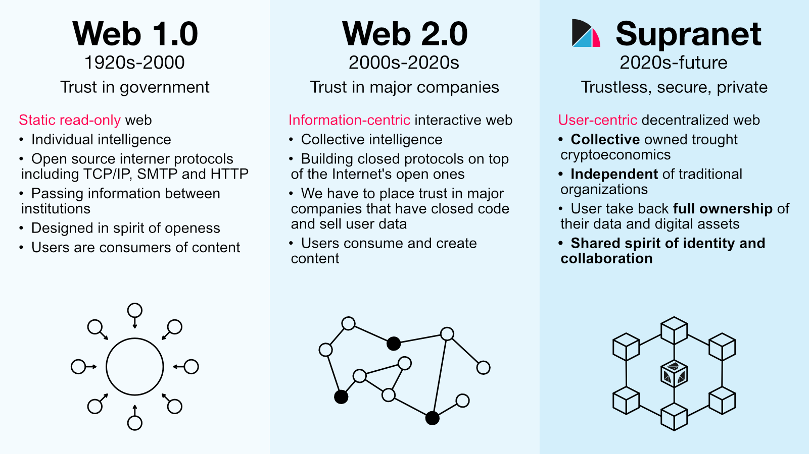

<!--
	{
		description: "F*ck Web 3.0! Why unyt.org Is Not Jumping on This Bandwagon",
		preview: "res/header-web3.0.png",
		date: ~2023-07-20~,
		tag: "Community",
		author: "unyt.org",
		authorRef: https://unyt.org
	};
-->

# F*ck Web 3.0! Why unyt.org Is Not Jumping on This Bandwagon
*Welcome, dear readers, to an article that boldly embraces a paradox*: Today, we delve into the enigmatic realm of **Web 3.0**, exploring why our beloved [unyt.org](https://unyt.org), with characteristics of a Web 3.0 project, refuses to embrace that very label. *So, grab your digital popcorn, sit back, and let's embark on this quirky journey of discovery.*

## Defining the term "Web 3.0"
Before we venture further, let's address the elephant in the server room: **What exactly is Web 3.0?** The truth is, nobody really knows! The term has been tossed around so much that it has become a buzzword of epic proportions, bandied about with reckless abandon. Some say it's about [decentralized](https://en.wikipedia.org/wiki/Decentralization) platforms, others mention [AI](https://en.wikipedia.org/wiki/Artificial_intelligence) and [machine learning](https://en.wikipedia.org/wiki/Machine_learning). *It's a bit like a tech version of "Where's Waldo?" — everyone's searching for it, but no one knows exactly what they're looking for.*

However, let's try to give a definition for the term "Web 3.0" from our point of view. To comprehend the significance of this topic, we must first understand the evolution of the web:

### The Evolution of the Web
[Sir Tim Berners-Lee](https://en.wikipedia.org/wiki/Tim_Berners-Lee), the visionary British computer scientist, invented the World Wide Web (WWW) back in 1989. His groundbreaking creation laid the foundation for the interconnected web we know today.

#### Web 1.0: The Dawn of the Internet
Web 1.0 was the internet of static web pages, where users could access information. It provided a platform for static web pages where users could passively access and consume information. The focus was on one-way communication, with limited interactivity and user participation. 

#### Web 2.0: The Rise of User Engagement
The advent of Web 2.0 marked a paradigm shift in the internet's evolution. It brought forth a more dynamic and interactive online experience, fueled by user-generated content, social media, and interactive web applications. Web 2.0 transformed the internet into a participatory platform, where individuals could create, share, and connect with others on a global scale. Nowadays major companies and their services run the largest parts of the web.

#### Web 3.0: The Decocratic Web
Web 3.0 represents the next phase of the internet's evolution, building upon the foundations laid by its predecessors. It encompasses a vision of a decentralized interconnection, where individuals regain control over their digital lives and interactions with focus on privacy, security and fairness based on these key pillars:

* **Decentralization**: Web 3.0 leverages emerging technologies like blockchain to create decentralized networks that foster trust, security, and transparency. By removing the need for intermediaries, Web 3.0 empowers users and enables peer-to-peer interactions.
* **Data Ownership**: Web 3.0 puts the power back into the hands of users. It emphasizes data ownership, privacy, and control over personal information, enabling individuals to determine how their data is used and shared.
* **Interoperability**: Web 3.0 promotes interoperability, allowing different applications and platforms to seamlessly communicate and exchange data. This interconnectedness facilitates the creation of a cohesive and efficient digital ecosystem.

## Why "Web 3.0" Has Become a Buzzword
One of the main reasons why the term "Web 3.0" has become controversial is the **prevalence of crypto scams** and **misinformation in the cryptocurrency space**. The term is often associated with decentralized technologies such as blockchains, and many fraudulent actors have taken advantage of this association to promote scams and false information to the general public. The proliferation of these scams has led to a general distrust of the Web 3.0 concept and has resulted in the term being associated with fraud and deception.

Another reason why the term has become tarnished is due to the lack of clarity and consensus on what it actually means. While some people see Web 3.0 as the next generation of the internet, with increased decentralization, privacy, and security, others see it as simply a marketing term used to promote blockchain and cryptocurrency. This lack of clarity and consensus has led to the term being widely criticized as a vague and meaningless buzzword.

Moreover, the term "Web 3.0" has been used in a half-baked manner by mainstream media and businesses, further contributing to its negative perception. Many of these organizations have misused the term **to promote their products and services**, without actually understanding the underlying technologies or their potential implications. There is a great deal of hype surrounding Web 3.0 and many projects and companies that claim to be part of this new era. Unfortunately, many of these projects are untested and unproven, and some are even scams. This has led to skepticism and mistrust in the Web 3.0 concept, even though the underlying idea has never changed.

All of the above have contributed to a widespread dissemination of misinformation, unrealistic expectations and has reinforced the idea that the term is simply a **marketing gimmick**.

## Web 3.0: A Stolen Identity
The [unyt.org](https://unyt.org) project has made the decision to **not use the term "Web 3.0" on the project**, despite the fact that [unyt.org](https://unyt.org) as a whole does indeed match its characteristics, because the term has become more and more controversial in recent years. 

We don't want to be associated with scam and pump-and-dump schemes. The [unyt.org](https://unyt.org) stands for something genuine, something meaningful, the future of democracy and internet... *we are not just "another cool crypto project"*!

## We Are More than Buzzwords
Instead of chasing the Web 3.0 hype train, we focus on building a trustless, secure, and Open-Source ecosystem that allows for a fully decentralized future. We believe actions speak louder than buzzwords. Our mission is to empower individuals, fuel innovation, and foster equal opportunities. *So, excuse us while we hop off the bandwagon and go build something awesome in our decentralized corner.*

## Conclusion
In conclusion, dear readers, it's time to bid farewell to the Web 3.0 hype train. Our mission is to make a real impact for forming a fair secure and deocratic internet, not just ride the wave of catchy phrases. We invite you to join us in this adventure, where innovation meets purpose and where progress is measured not by buzzwords, but by meaningful change. **Together, let's build a future that embraces the real potential of technology.**